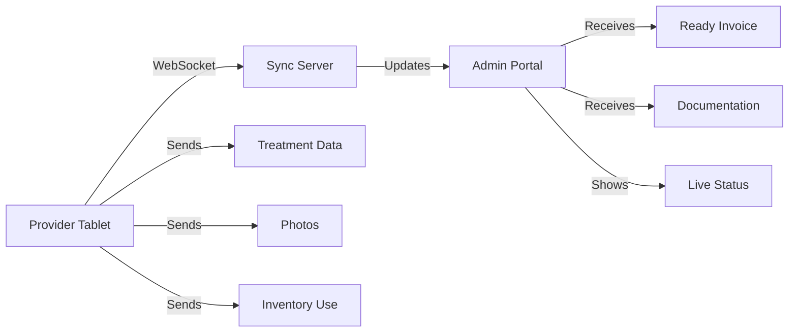

# Provider Tablet Interface - Complete Roadmap & Architecture

## The Problem We Missed
Medical spas have a TWO-PART workflow:
1. **Provider documents in treatment room** (iPad/Tablet)
2. **Front desk processes payment** (Desktop)

We built everything assuming front desk does all documentation - that's wrong!

---

## 🎯 Clear Separation of Responsibilities

### 📱 Provider Tablet App (Treatment Room)
**Purpose:** Real-time treatment documentation by the provider performing the service

**What it OWNS:**
- Treatment documentation
- Photo capture
- Clinical charting
- Inventory lot tracking
- SOAP notes
- Treatment protocols

### 💻 Admin Portal (Front Desk)
**Purpose:** Business operations, scheduling, and financial transactions

**What it OWNS:**
- Appointment scheduling
- Payment processing
- Financial reporting
- Patient check-in/out
- Insurance/billing
- Business analytics

---

## 📋 Complete Feature Distribution

### Features that MUST MOVE to Provider Tablet

#### 1. Treatment Documentation
- **Injectable Billing Calculator** → Provider documents units WHILE injecting
- **Face Chart Zone Mapping** → Real-time tap-to-document
- **Unit/Syringe Tracking** → As products are used
- **Lot Number Entry** → Scanned when vial opened
- **Expiration Date Tracking** → At point of use
- **Dilution Ratios** → Provider records their mix
- **Injection Depth/Angle** → Clinical documentation

#### 2. Photo Management
- **Before Photos** → Taken BEFORE treatment starts
- **After Photos** → Taken immediately post-treatment
- **Progress Photos** → During multi-session treatments
- **Consent Capture** → Photo consent before first photo
- **Angle Guides** → Overlay for consistent photos
- **Comparison Tools** → Side-by-side viewing

#### 3. Clinical Documentation
- **SOAP Notes** → Provider's clinical observations
- **Treatment Plans** → Multi-session planning
- **Contraindications Check** → Before treatment starts
- **Allergies/Reactions** → Real-time documentation
- **Complication Notes** → If issues arise
- **Provider Comments** → Clinical observations

#### 4. Inventory at Point of Use
- **Lot Number Scanning** → Barcode/manual entry
- **Product Selection** → What was actually used
- **Quantity Used** → Real amount (not estimate)
- **Waste Tracking** → Unused product disposal
- **Auto-deduction** → From inventory when confirmed

### Features that STAY in Admin Portal

#### 1. Financial Operations
- **Payment Processing** → All payment methods
- **Tips & Gratuities** → Added at checkout
- **Discounts/Promotions** → Applied by front desk
- **Package/Membership Redemption** → During payment
- **Receipt Generation** → After payment
- **Refunds/Credits** → Financial adjustments

#### 2. Scheduling & Check-in
- **Appointment Booking** → Phone/online scheduling
- **Patient Check-in** → Arrival confirmation
- **Room Assignment** → Traffic management
- **Wait List Management** → Fill cancellations
- **Provider Schedule Management** → Time blocks

#### 3. Reports & Analytics
- **Daily Cash Reconciliation** → End of day
- **Revenue Reports** → Financial analytics
- **Provider Performance** → Productivity metrics
- **Inventory Reports** → Stock levels, reorders
- **Patient Analytics** → Retention, frequency

#### 4. Patient Management
- **Demographics** → Contact info, insurance
- **Financial History** → Payments, balances
- **Appointment History** → Past and future
- **Communications** → Email, SMS campaigns
- **Loyalty Programs** → Points, rewards

---

## 🔄 Integration Points & Data Flow

### Real-time Sync Requirements



### Status Flow
1. **"Waiting"** → Patient checked in, not in room
2. **"In Room"** → Provider opened chart
3. **"Documenting"** → Active treatment documentation
4. **"Photos"** → Capturing images
5. **"Review"** → Provider reviewing before submit
6. **"Ready for Payment"** → Documentation complete
7. **"Processing"** → Payment in progress
8. **"Complete"** → Check out done

### Data Sync Points
- **On Every Tap** → Auto-save injection points
- **On Photo Capture** → Immediate upload
- **On Product Selection** → Inventory check
- **On Treatment Complete** → Full sync & invoice generation
- **On Network Restore** → Queue flush

---

## 💾 Admin Portal Modifications Needed

### 1. Remove These Features
```diff
- Injectable Billing Calculator button
- Photo capture during billing
- Face chart editing in billing
- Lot number entry at checkout
- Treatment documentation forms
```

### 2. Add These Features
```diff
+ Live treatment status dashboard
+ Provider activity monitor
+ Documentation received indicator
+ View-only treatment details
+ Sync status indicators
+ Provider completion notifications
```

### 3. Modify These Features
- **Billing Page** → Becomes payment-only interface
- **Live Treatment Status** → Shows real provider activity
- **Invoice View** → Displays provider-documented services
- **Reports** → Include provider productivity metrics

---

## 📊 Implementation Phases

### Phase 1: Foundation (Week 1)
**Provider Tablet:**
- Basic provider authentication
- Schedule view
- Patient chart access
- Simple treatment form

**Admin Portal:**
- Remove treatment documentation
- Add status monitoring
- Create view-only treatment display

### Phase 2: Core Documentation (Week 2)
**Provider Tablet:**
- Injectable face chart
- Unit calculator
- Lot tracking
- Auto-save

**Admin Portal:**
- Real-time status updates
- Invoice auto-population
- Documentation viewer

### Phase 3: Photo Integration (Week 3)
**Provider Tablet:**
- Camera integration
- Before/after workflow
- Photo consent
- Gallery view

**Admin Portal:**
- Photo thumbnail display
- Full-size viewer
- Export capabilities

### Phase 4: Advanced Features (Week 4)
**Provider Tablet:**
- Offline mode
- Queue management
- Other treatment types
- Templates/protocols

**Admin Portal:**
- Sync monitoring
- Conflict resolution
- Provider analytics

---

## 🎨 UI/UX Considerations

### Provider Tablet Design
- **Minimum touch target:** 44x44 pts (Apple HIG)
- **Font size:** 16pt minimum
- **Contrast:** WCAG AAA for medical environment
- **Orientation:** Support both portrait/landscape
- **Gestures:** Pinch to zoom on charts
- **Feedback:** Haptic on important actions

### Admin Portal Adjustments
- **Status badges:** Clear, color-coded
- **Auto-refresh:** Every 5 seconds during active treatments
- **Notifications:** Desktop alerts for completed treatments
- **Split view:** Documentation | Payment side-by-side

---

## 🔐 Security & Compliance

### Provider Tablet
- **Provider-specific login** → Biometric preferred
- **Auto-logout** → After 15 min inactive
- **Patient data encryption** → At rest and transit
- **Audit trail** → Every action logged
- **E-signature** → For consent forms

### Admin Portal
- **View-only permissions** → For clinical data
- **Financial permissions** → Separate from clinical
- **HIPAA compliance** → PHI protection
- **PCI compliance** → Payment data isolation

---

## 📈 Success Metrics

### Provider Adoption
- Time to document treatment: < 2 minutes
- Photos per treatment: 2-6 average
- Offline resilience: 100% data recovery
- User satisfaction: > 4.5/5

### Admin Efficiency  
- Checkout time: < 1 minute
- Documentation accuracy: 99%+
- Sync delays: < 2 seconds
- System uptime: 99.9%

---

## 🚀 Next Steps for Admin Portal

### Immediate Actions
1. **Disable** injectable billing calculator in admin
2. **Convert** face chart to view-only mode
3. **Remove** photo capture from billing flow
4. **Add** provider status indicators

### Near-term Development
1. **Build** WebSocket connection for live updates
2. **Create** provider activity dashboard
3. **Implement** invoice auto-population from provider data
4. **Add** notification system for completed treatments

### Long-term Integration
1. **Develop** comprehensive sync monitoring
2. **Build** offline queue management
3. **Create** provider performance analytics
4. **Implement** advanced conflict resolution

---

## 📚 Technical Specifications

### WebSocket Events
```typescript
// From Provider Tablet
'treatment.started'
'treatment.photo_captured'
'treatment.zone_documented'
'treatment.product_used'
'treatment.completed'

// To Admin Portal
'treatment.status_changed'
'treatment.documentation_received'
'treatment.ready_for_payment'
'treatment.sync_conflict'
```

### Data Models
```typescript
interface TreatmentSession {
  id: string
  providerId: string
  patientId: string
  roomNumber: string
  startTime: Date
  status: TreatmentStatus
  documentation: TreatmentDoc[]
  photos: TreatmentPhoto[]
  products: ProductUsage[]
  syncStatus: SyncStatus
}
```

---

## 🎯 Summary

The key insight is that **providers document in real-time during treatment**, while **admin handles business operations**. Our admin portal should:

1. **Stop trying to capture clinical data** at the front desk
2. **Focus on payment processing** and business operations  
3. **Display provider-documented data** in read-only format
4. **Maintain real-time sync** with provider tablets

This separation ensures:
- Legal compliance (provider documents their own work)
- Accuracy (real-time documentation)
- Efficiency (parallel workflows)
- Professional standards (matches industry leaders)

---

*Last Updated: August 2025*
*Document Version: 2.0*
*Major Revision: Separated provider vs admin responsibilities*